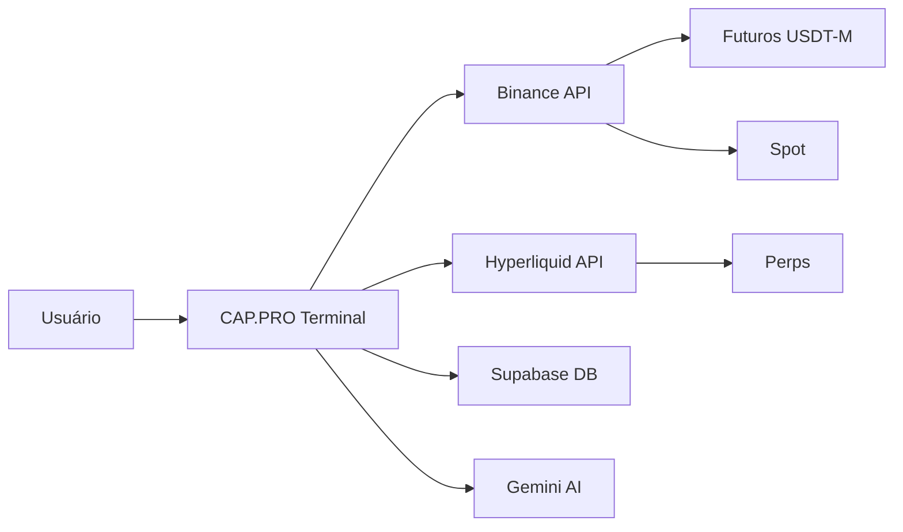
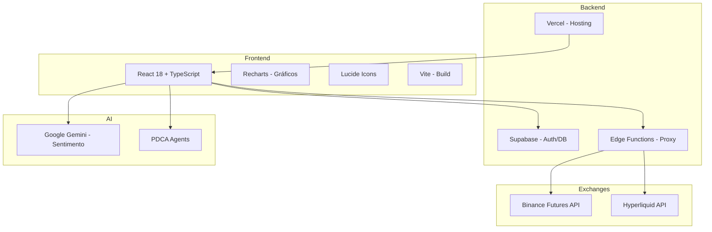

# 📄 CAP.PRO Terminal — Whitepaper

**Plataforma de Trading Algorítmico para Futuros de Criptomoedas**
**Versão**: 2.0 | **Data**: Março 2026

---

## Visão Geral do Produto

O **CAP.PRO Terminal** é uma plataforma de trading algorítmico para mercados de futuros de criptomoedas. Ele conecta-se a exchanges como **Binance** e **Hyperliquid** via API, permitindo automação de operações, gestão de risco, monitoramento de carteira e análise técnica — tudo em uma interface web única.

---

## 1. 📊 Visão Geral (Dashboard)

### Explicação Simples
> A "página inicial" do terminal. Mostra um resumo de tudo: quanto dinheiro você tem, quantas posições estão abertas, o lucro/prejuízo do dia, e um gráfico da evolução do seu patrimônio.

### Detalhamento Técnico

| Componente | Descrição |
|---|---|
| **Saldo Total** | Margin Balance total do Futures, obtido via `/fapi/v2/account` |
| **PnL Não Realizado** | Lucro/prejuízo das posições abertas (flutuante) |
| **Posições** | Quantidade de posições ativas (LONG/SHORT) |
| **Win Rate** | Percentual de trades lucrativos vs total |
| **Melhor/Pior Trade** | Maior lucro e maior prejuízo entre os últimos 500 trades |
| **Meta Diária** | Percentual configurável como alvo de ganho diário |
| **Saldo do Dia** | Início, Atual, Ganhos e Perdas do dia corrente |
| **Modo de Risco** | Perfil ativo (Geral, Conservador, Agressivo) |
| **Curva de Patrimônio** | Gráfico temporal da evolução do saldo, com filtros de período (1H, 1D, 1W, 1M, ALL) |
| **Ordens Positivas/Negativas** | Lista de posições separadas por lucro ou prejuízo |
| **Histórico de Trades** | Últimos trades realizados com símbolo, lado, PnL e data |
| **Perfis Ativos** | Cards dos perfis de estratégia em execução com capital alocado |

**Fonte dos dados**: API Binance (`/fapi/v1/income` para histórico, `/fapi/v2/account` para saldo) + Supabase (`balance_history` para curva).

---

## 2. ⚙️ Motor Algorítmico (Strategies)

### Explicação Simples
> Aqui ficam os "robôs" de trading. Cada perfil é um robô com regras próprias — por exemplo, um robô conservador que opera com pouca alavancagem, e outro agressivo que busca lucros maiores. Você pode criar, editar, ativar/desativar cada um.

### Detalhamento Técnico

Cada **Perfil de Estratégia** contém:

| Parâmetro | Descrição |
|---|---|
| **Nome** | Identificador do perfil (Seguro, Moderado, Ousado, etc.) |
| **Capital** | Valor alocado para este perfil (em USD) |
| **Alavancagem** | Multiplicador (2x–20x) |
| **Stop Loss / Take Profit** | Percentuais de proteção e realização |
| **Signal Threshold** | Limiar mínimo de sinal técnico para abrir posição |
| **Max Open Positions** | Limite de posições simultâneas |
| **Active** | Toggle ligado/desligado |

**Ciclo de operação do Motor**:
1. Seleciona o próximo par da lista (ex: BTCUSDT)
2. Busca candles via API (`/fapi/v1/klines`)
3. Executa análise técnica unificada (RSI, MACD, Bollinger, ATR, Volume)
4. Se o sinal > threshold → abre ordem de mercado com TP/SL
5. Registra no audit log e mapa de posições

---

## 3. 💰 Carteira Real (Wallet)

### Explicação Simples
> Mostra todo o dinheiro que você tem na exchange. Separa entre **Futures** (para trading alavancado) e **Spot** (ativos mantidos sem alavancagem). Também mostra cada posição aberta com PnL em tempo real e permite fechar posições.

### Detalhamento Técnico

| Campo | Fonte |
|---|---|
| **Saldo Futures** | `/fapi/v2/account` → `totalMarginBalance` |
| **Saldo Spot** | `/sapi/v3/asset/getUserAsset` (com fallbacks) |
| **PnL Flutuante** | Soma de `unrealizedProfit` de todas as posições |
| **PnL Realizado** | Soma de income via `/fapi/v1/income` |
| **Posições** | Quantidade de posições com `positionAmt ≠ 0` |

**Funcionalidades**:
- Lista de posições com detalhes (preço médio, tamanho, lado, PnL)
- Alocação por ativo (gráfico de pizza)
- Histórico de PnL cumulativo (gráfico de área)
- Botão "Fechar Posição" individual e "Fechar Todas"
- Filtros de período (1H, 12H, 1D, 1S, 1M, 3M, 6M, 1A, MAX)

---

## 4. 📋 Historial (Trade History)

### Explicação Simples
> Um registro completo de todos os trades já realizados. Mostra quando você comprou/vendeu, qual o ativo, o lucro ou prejuízo de cada operação, e você pode filtrar por período ou símbolo.

### Detalhamento Técnico

- Busca dados via [fetchTradeHistory()](file:///c:/Users/6122788/Downloads/FixSports/crypto-analyzer-v10%20%282%29/src/services/exchangeService.ts#445-478) → `/fapi/v1/income` (tipo REALIZED_PNL)
- Para Hyperliquid: usa `fetchHLTradeHistory()` com endpoint específico
- Exibe: Símbolo, Lado (BUY/SELL), Quantidade, Entrada, PnL, Status (OPEN/CLOSED), Data
- Filtros por exchange ativa e por período
- Limitado a últimos 1000 trades da API

---

## 5. 📈 Análise de Fluxo (Analysis View)

### Explicação Simples
> Uma ferramenta de análise técnica. Selecione qualquer par (ex: BTCUSDT) e veja indicadores como RSI, MACD, Bollinger Bands, além de um sinal geral de compra/venda. Usa IA (Gemini) para análise de sentimento do mercado.

### Detalhamento Técnico

| Componente | Tecnologia |
|---|---|
| **Análise Técnica** | RSI, MACD, Bollinger Bands, ATR, Volume Profile |
| **Multi-Timeframe** | Consenso entre 5m, 15m, 1h, 4h (via `multiTimeframeService`) |
| **Sentimento IA** | Google Gemini API via `sentimentService` |
| **Dados de Mercado** | CoinGecko + CryptoCompare para sentimento social |
| **Filtro de Volatilidade** | VPM Calculator + ATR Filter via `volatilityFilter` |

**Fluxo**:
1. Seleciona par → Busca candles históricos
2. Calcula indicadores técnicos unificados
3. Gera sinal: STRONG_BUY / BUY / NEUTRAL / SELL / STRONG_SELL
4. Opcionalmente consulta Gemini para análise de sentimento

---

## 6. 🛡️ Gestão de Riscos (Risk Management)

### Explicação Simples
> Configura os limites de proteção. Define quanto você quer ganhar por dia (meta), quanto aceita perder (stop diário), e qual nível de risco geral usar. Se atingir a meta, o sistema avisa. Se atingir o stop, ele para automaticamente.

### Detalhamento Técnico

| Parâmetro | Descrição |
|---|---|
| **Meta Diária (%)** | Percentual de ganho sobre o saldo inicial do dia |
| **Stop Loss Diário (%)** | Percentual máximo de perda aceitável |
| **Modo de Risco** | Geral, Conservador ou Agressivo |
| **Circuit Breaker** | Após N perdas consecutivas, pausa o motor por 30 minutos |
| **Perdas Consecutivas** | Contador automático (reseta ao ter trade positivo) |

**Modos de Risco**:
- **Geral**: Meta +10%, Stop -5%, sem limitações extras
- **Conservador**: Meta +5%, Stop -3%, alavancagem máxima 5x
- **Agressivo**: Meta +20%, Stop -10%, permite mais posições

---

## 7. 🔒 VPN (VPN Manager)

### Explicação Simples
> Gerencia conexões VPN para proteger sua privacidade ao operar. Mostra o status da conexão, permite conectar/desconectar, e exibe estatísticas de uso.

### Detalhamento Técnico

- Gerencia múltiplas conexões VPN via `vpnService`
- Tipos: OpenVPN, WireGuard, IPSec
- Estados: Conectado, Desconectado, Conectando
- Métricas: velocidade, latência, tempo de conexão
- Status exibido no header do terminal com indicador visual
- Logs de conexão/desconexão registrados

---

## 8. 🧠 Agentes IA (PDCA Dashboard)

### Explicação Simples
> Agentes de Inteligência Artificial autônomos que operam em ciclo PDCA (Plan-Do-Check-Act). Eles planejam estratégias, executam, avaliam resultados e ajustam automaticamente. É como ter analistas robóticos trabalhando 24/7.

### Detalhamento Técnico

**Ciclo PDCA de cada agente**:

| Fase | Ação |
|---|---|
| **Plan** | Analisa mercado, define estratégia e parâmetros |
| **Do** | Executa trades conforme a estratégia definida |
| **Check** | Avalia resultados vs expectativas |
| **Act** | Ajusta parâmetros para o próximo ciclo |

**Tipos de agentes**:
- **Scout**: Varredura de mercado, identificação de oportunidades
- **Trader**: Execução de ordens baseada em sinais
- **Risk**: Monitoramento de risco e ajuste de posições
- **Optimizer**: Otimização contínua de parâmetros

Gerenciado pelo `pdcaAgentService` com estado persistido no Supabase.

---

## 9. 📝 Auditoria (Audit Log)

### Explicação Simples
> Um diário completo de tudo que aconteceu no sistema. Cada ordem executada, cada erro, cada sinal gerado — tudo fica registrado aqui. Útil para entender o que o robô fez e por quê.

### Detalhamento Técnico

| Campo | Descrição |
|---|---|
| **Horário** | Timestamp do evento |
| **Nível** | INFO, WARN, ERROR, SUCCESS |
| **Ação** | ORDER_PLACED, ORDER_CLOSED, ORDER_FAILED, SIGNAL_GENERATED |
| **Perfil** | Nome do perfil que gerou a ação |
| **Par** | Símbolo do ativo (ex: BTCUSDT) |
| **Valor** | Quantidade ou PnL envolvido |
| **Detalhes** | JSON com parâmetros completos |

**Filtros**: Todos, INFO, WARN, ERROR, SUCCESS, SIGNAL_GENERATED, ORDER_PLACED, ORDER_CLOSED

**Fonte**: Supabase `audit_logs` + logs locais em memória. Persistidos via `auditService`.

---

## 10. ⚙️ Ajustes API (Exchange Manager)

### Explicação Simples
> Onde você conecta sua conta da exchange. Insere sua API Key e Secret da Binance (ou outra exchange), e o sistema valida a conexão. Depois de conectar, todos os dados fluem automaticamente.

### Detalhamento Técnico

**Exchanges suportadas**:
- **Binance** (Futuros USDT-M, Testnet e Produção)
- **Hyperliquid** (Perps L1)
- **Bybit** (placeholder para futuro)

**Fluxo de conexão**:
1. Usuário insere API Key + Secret
2. Sistema valida via [validateApiCredentials()](file:///c:/Users/6122788/Downloads/FixSports/crypto-analyzer-v10%20%282%29/src/services/exchangeService.ts#173-201) → testa `/fapi/v2/balance`
3. Se válido: salva credenciais (criptografadas) no Supabase
4. Status atualizado para CONNECTED
5. Dados começam a fluir (saldo, posições, trades)

**Segurança**: 
- Credenciais trafegam via HTTPS
- Armazenadas no Supabase com RLS (Row Level Security) por user_id
- Proxy Supabase Edge Function para assinatura HMAC-SHA256

---

## 11. ℹ️ Info (Information Tab)

### Explicação Simples
> Página informativa sobre o CAP.PRO Terminal. Explica funcionalidades, versão do sistema, e fornece links úteis de documentação.

---

## 12. 👤 Perfil (User Profile)

### Explicação Simples
> Suas configurações pessoais. Mostra email, nome de exibição, e permite alterar senha e preferências da conta.

### Detalhamento Técnico

- Autenticação via Supabase Auth (email/senha)
- Perfil armazenado na tabela `profiles` do Supabase
- Sessão JWT com refresh automático
- Opção de logout

---

## Funcionalidades Transversais

### 🔔 Notificações

Centro de notificações integrado no header. Alertas sobre:
- Trades executados
- Metas atingidas
- Erros de API
- Alertas de risco

### 📡 Proxy de API

Todas as chamadas à Binance passam por um proxy (Supabase Edge Function ou Vercel API Route) para:
- Assinar requisições com HMAC-SHA256
- Contornar bloqueios de ISP/WAF
- Rate limiting no servidor

### 💾 Sincronização (Sync Service)

Dados são sincronizados entre:
- **Supabase** (persistência) ↔ **LocalStorage** (cache) ↔ **State React** (UI)
- Auto-save de perfis e configurações
- Fallback para cache local quando Supabase indisponível

---

## Arquitetura Técnica

---

## Stack Tecnológica

| Camada | Tecnologia |
|---|---|
| **Frontend** | React 18, TypeScript, Vite |
| **Gráficos** | Recharts |
| **UI/UX** | TailwindCSS (utility classes inline) |
| **Autenticação** | Supabase Auth |
| **Banco de Dados** | Supabase PostgreSQL |
| **Serverless** | Supabase Edge Functions (Deno) |
| **Hosting** | Vercel |
| **IA** | Google Gemini API |
| **APIs** | Binance Futures, Hyperliquid, CoinGecko |

---

*CAP.PRO Terminal — Trading Inteligente para o Futuro* 🚀
